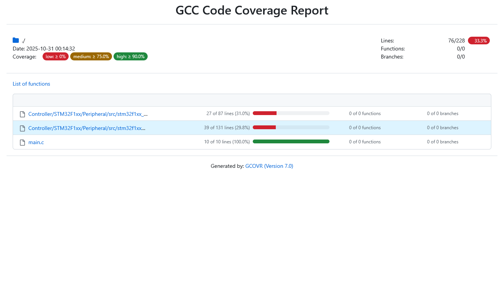

# gcov-demo-stm32f103

Small demo project showing how to use gcov on an embedded target.

<p align="center"></p>

## Requirements

* Hardware
  * STM32F103-series microcontroller
  * *SEGGER J-Link* or *ST-Link* debug probe (see also: [islandcontroller/jtag-wire-adapter](https://github.com/islandcontroller/jtag-wire-adapter))
* Software
  * Linux OS or WSL installation
  * [Docker Engine](https://docs.docker.com/engine/install/debian/) (running within WSL if applicable)
  * VSCode [Dev Containers](https://marketplace.visualstudio.com/items?itemName=ms-vscode-remote.remote-containers) extension
  * (WSL only) [usbipd-win](https://learn.microsoft.com/en-us/windows/wsl/connect-usb)

## Usage

* Clone this repository using the following command. Note the use of the `--recursive` tag.
  ```
  git clone --recursive https://github.com/islandcontroller/gcov-demo-stm32f103
  ```
* Open the folder in VSCode
* Connect debug probe
  * (WSL only) attach to WSL using `usbipd attach --wsl --busid <...>`. **This needs to be completed before starting the Dev Container.**
* Run the command "**Dev Containers: Reopen in Container**"
  * Check if the debug probe is recognised as a connected USB device by running `lsusb`.
  * On first launch, you may need to install some udev rules on your host machine. Copy the files to your workspace by running `setup-devcontainer` inside the container.
  * Re-open the workspace on your host and run the `install-rules` script inside the `.vscode/setup` folder.

        cd .vscode/setup
        sudo ./install-rules

  * Afterwards, restart the devcontainer.
* If prompted, select the "`Arm GNU Toolchain x.x`" CMake Kit. 
* Build and run using the debugger
* Wait until Semihosting access has finished ("Terminal" tab), then close the debug connection
* Run the "Process coverage and generate HTML report" task
* Run "Serve coverage report via HTTP" and open http://localhost:8000/coverage_report.html

## Licensing

If not stated otherwise in the specific file, the contents of this project are licensed under the MIT License. The full license text is provided in the [`LICENSE`](LICENSE) file.

    SPDX-License-Identifier: MIT
